# Quick Start with Razuna System

 Welcome to Razuna System. In this page , we will show you how to use our system to manage the data in smoothly.

Firstly user can login to system by account (username and password) which provided by System Admin or by Social accounts.

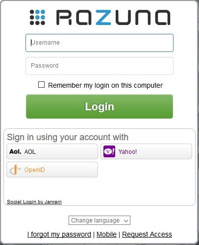

In the next stage , from the first screen of the Razuna system. We can see the structure of the folders from the left side within folder names. Besides of this , user able to browse the files follow the Collection , Smart folders or Labels. 

To browse the file follow the Collection or Smart folder or Labels. Please click into "Folders" on top of the folder structure and choose one kind of search for browsing.

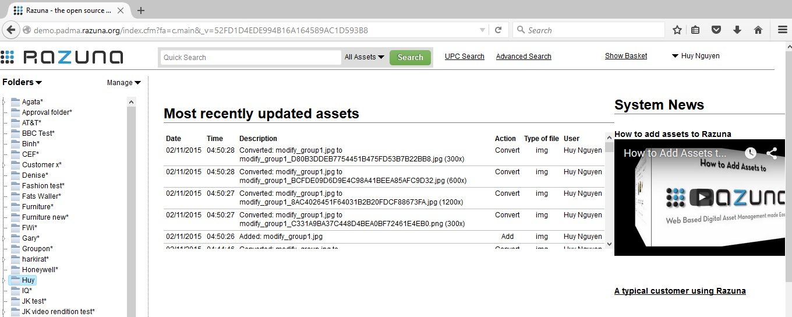

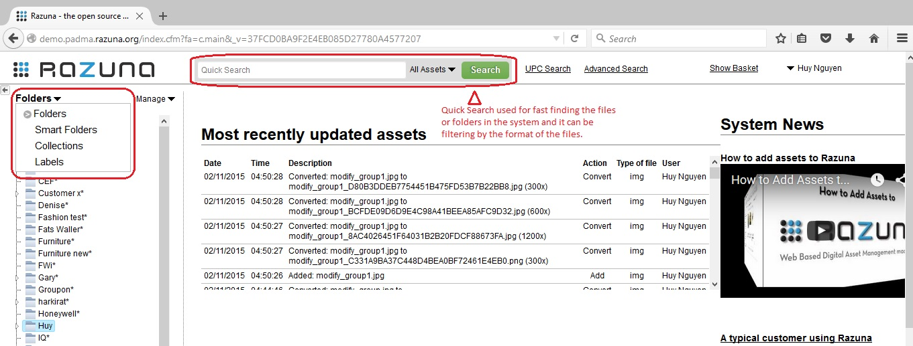
___
The "Advanced Search" allow us to find the file by criteria follow file format such as : Documents , Videos , Audios , Images or All of the formats. We can use file names , key words , descriptions , extension or metadata to search the files.

Please click to "Advanced Search" from Menu on top. The new windows of Advanced Search will appear for searching. After key in full the information for search, please click into "Find" button to continue.

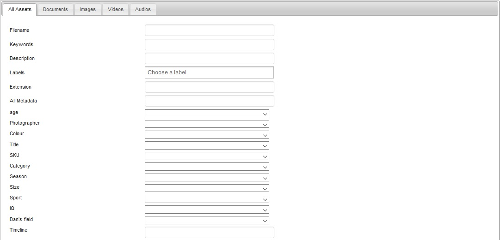

___
### Show Basket Feature :

If you want to send some of files by email or transfer it by FTP service or download them in one moment. We can help you by "Show Basket" feature. All you can do is just click into "Put in basket" icon from the files in your folders or also your collections which you want to move them into basket for process.

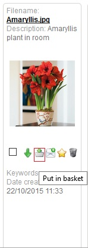

After you put the data to basket , Please click to "Show Basket" link from the menu on top to show the data in Basket.

From the Basket , user can download all the files in a zip file to local machine. Or "Save and Publish Basket" function will help you to Save basket content as a Zip , Save basket content as a Collection or Save basket content into a existing Collection. We provided some flexible choices for user when using our system. Please see the image as below :

___
Email Basket : 

From here , you can send data from the basket by email composer in easy way and comfortable.

___
FTP Basket :

Our system also support user through FTP service , you can click into FTP Basket and input FTP server address , username and password to get the authentication from FTP service and allow to transfer the data from Razuna.

___

Export Metadata :

This function help you to export the metadata (Metadata summarizes basic information about data, which can make finding and working with particular instances of data easier.) of your data to a format likes :  XLS , XLSX or CSV file. You just need to choose the format and click to export button to finish.

___
Remove Basket :

When user click this button , all the files in Basket will be clear from Basket.
___

### Manage Function :

From this part , users are able to create a new folder on the current level , reload the tree folder in the case if you are missing something this might help but usually not needed , Show folders from all users used to show the personal folders of your users.

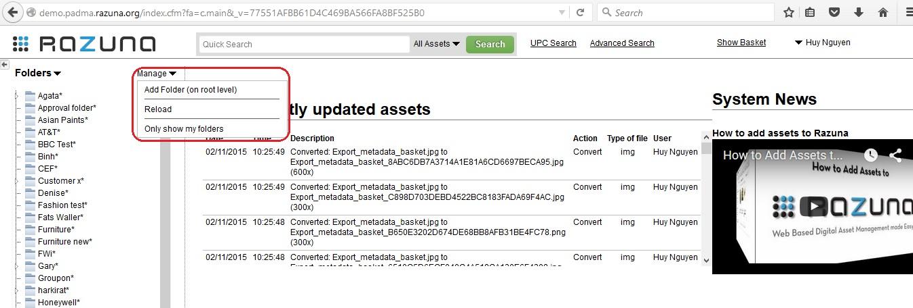

Add folder on root level :

In the following dialog window you are able to create a new folder on the current level. At this window , user can fill in the folder name and description. The languages for folder name and description are used in the case user want to change the default system language appearance to German , Italian or Japanese. 

After fill in step , we contine to set the permissions of folder for groups can be read , read / write or full access to this folder.

Finally we click Add button locate at bottom of dialog to finish.

Reload :
Reload the folder tree (usually not needed but if you are missing something this might help).

Show folder from all users :
Users can click to this part to show the personal folders of your users.
___

### How to add assets to Razuna

Add assets from local machine :

From your current folder on the left side, click into it and the contents in your folder will be show in main page. 

To add assets , please click into "Add your Files" button and the new window appear for browse the files which you want to upload from local machine.

In this window , users click into "Add files" to browse the local files for upload and then click to "Start upload" button to load the file to Razuna System.

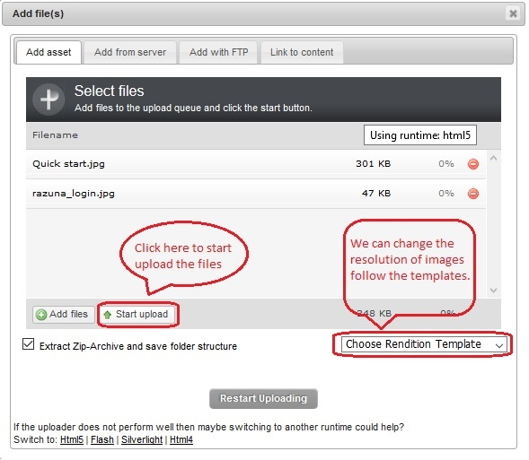

After uploading task completed , one more new window appears to require users input the metadata such as : Description , Label , Our Own Custom Field for the files which you have upload to Razuna system then click "Update Files" button to finish.

Finally , you can see your files showing on Razuna system now.

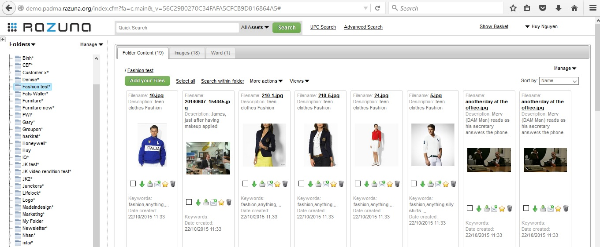
___

Add assets from Server :

For adding files from Server , all you can do is enter the corrected path to Razuna system , then checking it with Validate button to make sure the path you were entered is correct and click to Import from path to add assets from Server to Razuna System.

___

Add assets from FTP :

Please enter your FTP access information to be able to retrieve and store file from the FTP site in your system such as :

FTP server , Username , Password then Click into "Login to FTP site" button to finish.

___

Link to content :

If you do not want to import your asset into Razuna and simply want to link to it, then add the absolute path to the asset below or enter the URL to the asset (can be on Facebook, YouTube or just about any URL that is publicly available).

Local content (on your local network) can be indexed and also converted as usual, but will not be moved to the internal Razuna structure.

___

### Menu actions in your current folder :

Our system have a Menu actions inside your current folder which you will see when open it from the image as below :

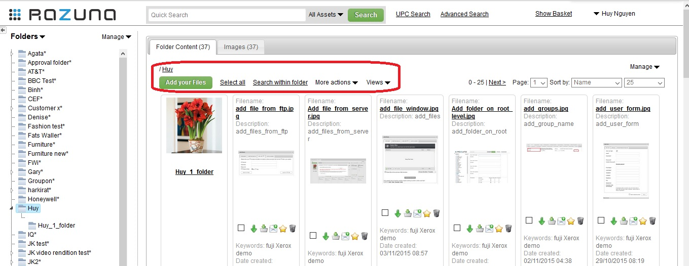

Select All : 

This action will allow user select all the data from the current folder for many purposes such as : Put in Basket , Create Alias , Move , Batch , Add to Existing Collection , Export Metadata or Change the Views (Thumbnail View , List View , Quick Edit View).

Or if you want to cancel the "Select All" action you can click into "Deselect All".

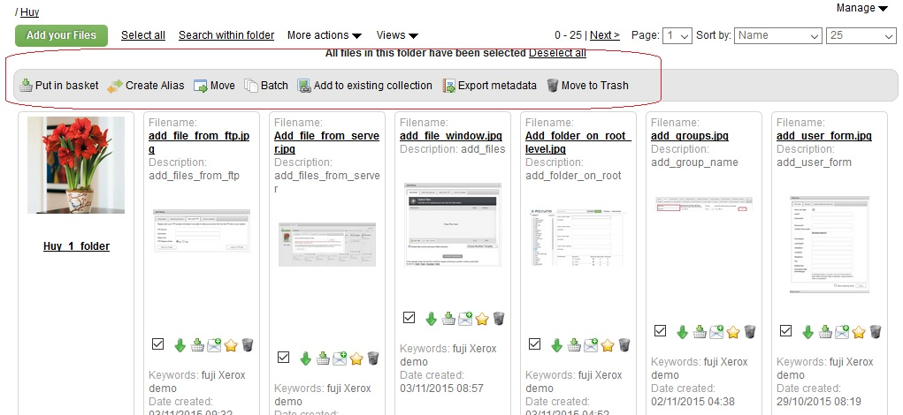

___

Search within folder :

In the case you have many files in your current folder and want to get it quickly so you can use "Search within folder" option. This option allow you filter data follow the format such as : Documents , Images , Videos and Audios or All Assets.

User just need enter the information related to the files likes : File name , Description , Label , Metadat.. etc.. and click "Find" to searching your data.

___

More actions :

These actions allow user perform the tasks such as : Add Folder , Add Folder to favourites , Show assets from sub folder , Print , Rss Feed of this folder , Create a Word Document , Export Metadata , Import Metadata , Download assets in this folder.

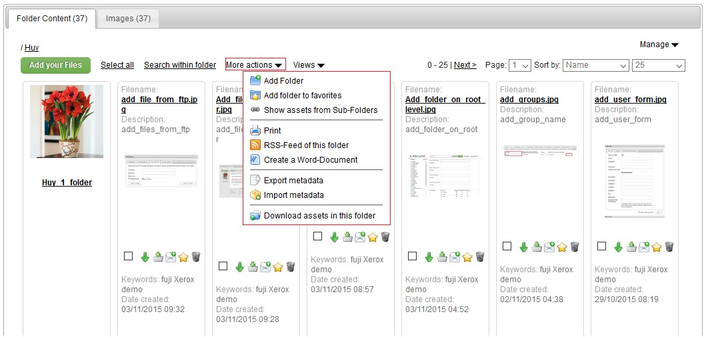

___

Views :

User can change the type of views from "Thumbnail View" to "List View" or "Quick Edit View"

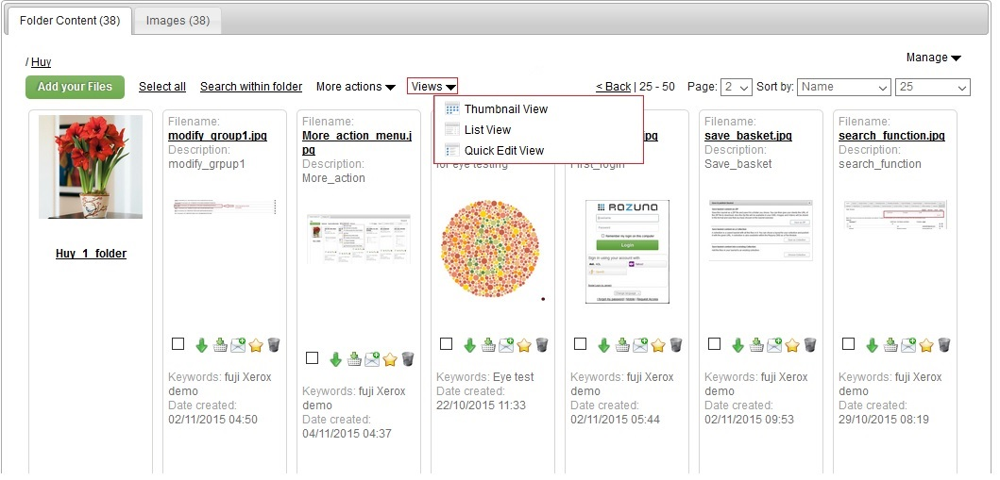

___

### Folder Management :

There are 2 options for user want to set the "Folder subscribe" and "Folder Sharing & Settings" at the Manage Folder Menu.

Folder subscribe :

Subscribe to changes in folder (and its subfolders) which will be emailed to you on specifed interval.

Folder Sharing & Settings :

* Folder Settings :

In this option , Razuna system allow user do setup the properties for current folder such as : Folder name , Description , Label , Permission for groups can be access to this folder , Apply workflow to files in this folder.

* Sharing Options : 

The sharing options will be used when you share a folder all files are accessible with the same group permissions. 

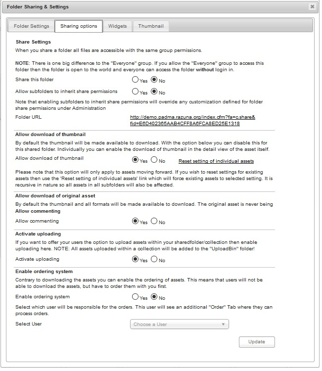

___

Widgets :

Widgets allow you to embed the assets in this folder/collection into any other web application, say a blog, CMS or alike.

You can create as many widgets you like, each with their own settings.

___

Thumbnail :

Choose Folder Thumbnail
By default the system shows a folder image for each folder. If you instead want to show your own thumbnails as the folder image, you can upload one here or choose from any existing image in this folder.

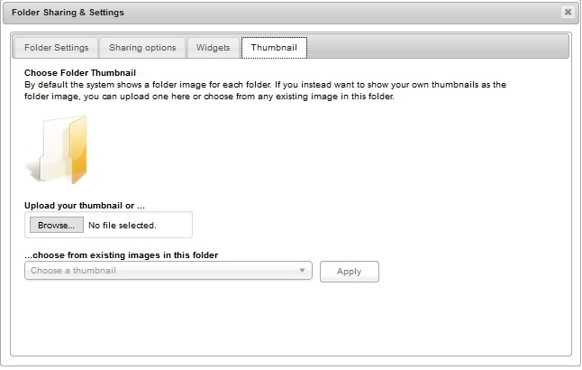

___

### File Management :

When user want to change some information of their files or edit something , user just need click into any file in their current folder and the new file management window will appear.

For example , just see the image as below :

From the sample image above , you can see the content of File Management is showing the tags including : Information , Renditions , Metadata , Comments , Versions , Sharing Options , History , Associated Collections.

____
 
"Information Tag" : 

User can modify the file's information likes : Filename , Description , Keywords , Labels , Expiry date. Also you can see the File size , Date added , Last modified , Located in (Folder name) , Created by (user) , ID.

Beside the showing information task , we also build an action menu at "Information Tag" with several functions such as :Put in Basket , Send via Email , Upload to FTP server , Print details , Add to Existing Collection , Move file , Move file to trash.

___

"Rendition Tag" :

This function will allow users to change the resolution of your image or video files and get the direct link from the preview or original file.

You can modify the resolution of files from pixel to dpi or do the opposite , or choose the suitable format files for your purpose.

After set the resolution , you click to "Convert" button to get the new resolution then you can get the direct link or get the file to local machine as well.

___

"Metadata Tag" :

The Metadata Tag provide for user many of metadata standards to input such as : IPTC , XMP or Custom Metadata for process. In addition , you can copy the metadata content from this part.

___

"Comments Tag" :

This Tag is used by for comment to the file to marking or taking note to remember the date , tasks or anything they want.

___

"Versions Tag" :

In this section , user have 2 options for versions of assets.

* Upload new version :
You can replace the current original asset with a new one by choosing the file below and upload it. The current version will be saved as a version and replaced by the new asset.

* Upload old version
Uploaded new assets will be added as old versions, current original asset do not get replaced.

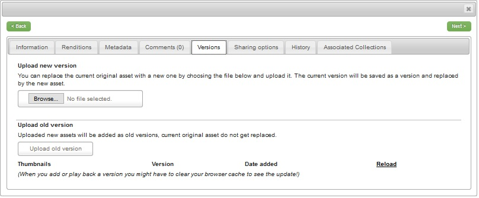

___

"Sharing Options Tag" :

Sharing Options are settings to sharing assets in the current folder. Users are able to set the file sharing options with 3 choices for each type of an asset : Downloadable , Orderable , Selected* (* Selected is valid when you use a widget. The selected asset is then used for the larger preview or for the slideshow.)

Users also can customize the sharing options and override these settings.

___

"History Tag" :

History is used for showing of the log of file such as : Created Date , Created Time , Description , Action , Type of file , User.

You can see or tracking the time when a file added to Razuna system and the time it was converted to other formats included its resolution information , and user who done it. 

___

"Assocciated Collections Tag"

One asset can be located in many collections from a system. If users want to know how many collections where storing the common file so we can use this function to check the number collections which the file is associated with.

___